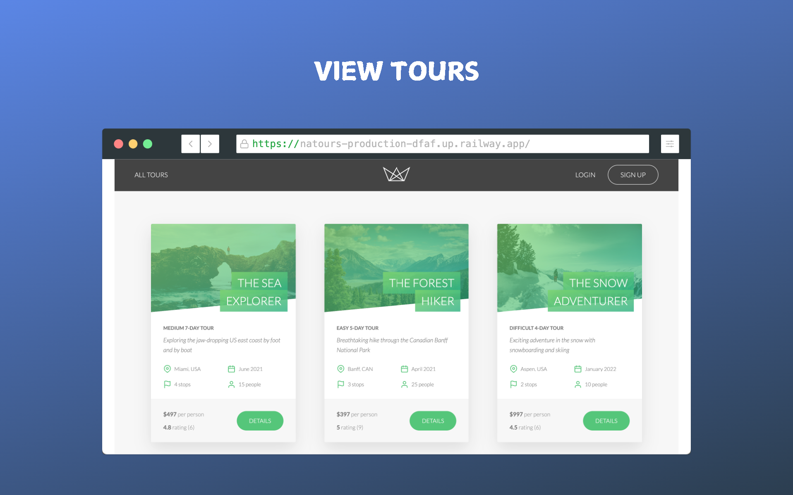
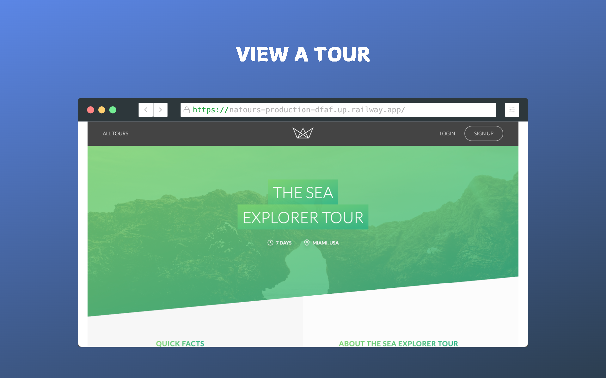
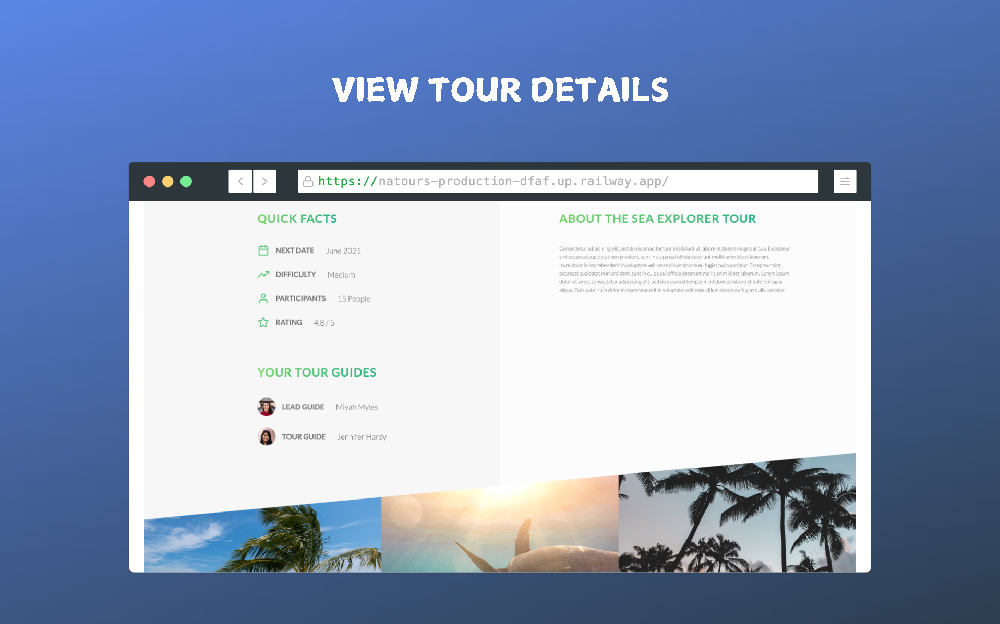
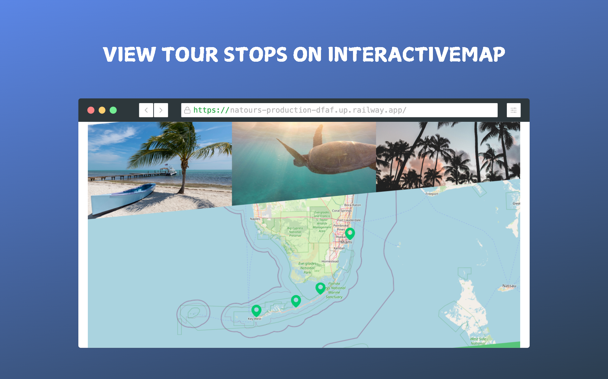
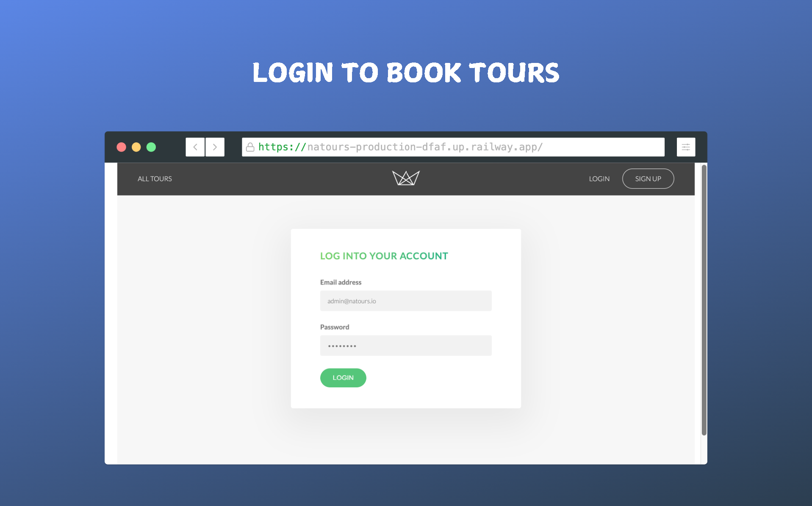

  

<h3 align="center">Natours</h3>

A Full-Stack project for viewing and booking different tours. The back end is a RESTful API that provides authentication and authorization for users, as well as CRUD operations on tours, bookings, and reviews. The front-end is server-side rendered pugs consuming the RESTful API and Stripe payment  

## Built With

* ![Nodejs]
* ![Express]
* ![JavaScript]
* ![Mongodb]
* ![Mongoose]
* ![Pug]
* ![Stripe]

## Screenshots

  
  
  
  
  

## Getting Started
* Try the website using the hosted version from [here](https://natours-production-dfaf.up.railway.app/)   

[JavaScript]: https://img.shields.io/badge/javascript-F7DF1E?style=for-the-badge&logo=javascript&logoColor=grey
[Nodejs]: https://img.shields.io/badge/node.js-5FA04E?style=for-the-badge&logo=node.js&logoColor=white
[Express]: https://img.shields.io/badge/express-000000?style=for-the-badge&logo=express&logoColor=white
[Mongodb]: https://img.shields.io/badge/mongodb-47A248?style=for-the-badge&logo=mongodb&logoColor=white
[Mongoose]: https://img.shields.io/badge/Mongoose-880000?style=for-the-badge&logo=Mongoose&logoColor=white
[Pug]: https://img.shields.io/badge/pug-A86454?style=for-the-badge&logo=pug&logoColor=white
[Stripe]: https://img.shields.io/badge/Stripe-008CDD?style=for-the-badge&logo=Stripe&logoColor=white
